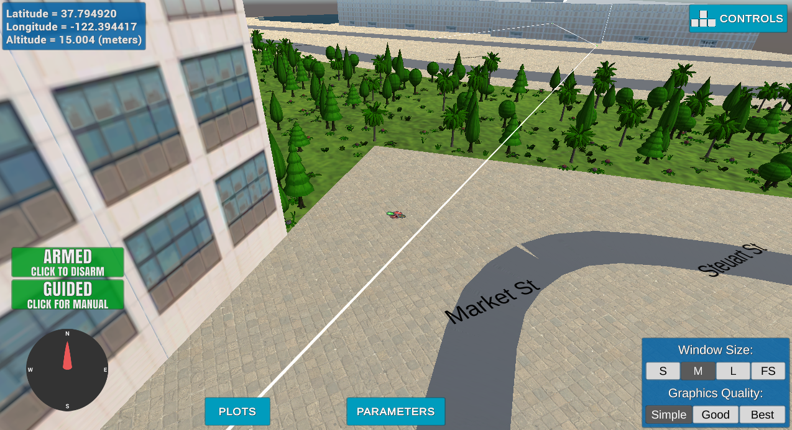
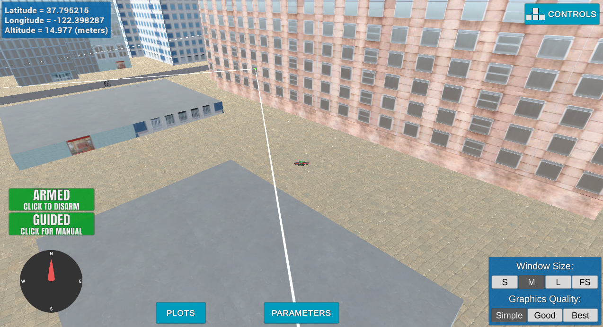
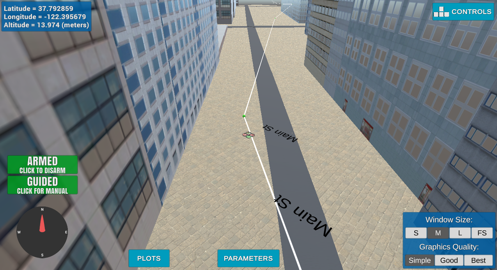
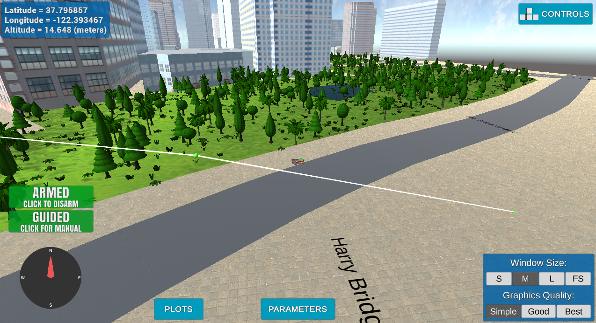

## Project: 3D Motion Planning


---


# Required Steps for a Passing Submission:
1. Load the 2.5D map in the colliders.csv file describing the environment.
2. Discretize the environment into a grid or graph representation.
3. Define the start and goal locations.
4. Perform a search using A* or other search algorithm.
5. Use a collinearity test or ray tracing method (like Bresenham) to remove unnecessary waypoints.
6. Return waypoints in local ECEF coordinates (format for `self.all_waypoints` is [N, E, altitude, heading], where the drone’s start location corresponds to [0, 0, 0, 0].
7. Write it up.
8. Congratulations!  Your Done!


## [Rubric](https://review.udacity.com/#!/rubrics/1534/view) Points

Here I will consider the rubric points individually and describe how I addressed each point in my implementation.

---
### Writeup / README

Criteria:

> Provide a Writeup / README that includes all the rubric points and how you addressed each one. You can submit your writeup as markdown or pdf.

You're reading it! Below I describe how I addressed each rubric point and where in my code each point is handled.

### Explain the Starter Code

Criteria:

> Test that motion_planning.py is a modified version of backyard_flyer_solution.py for simple path planning. Verify that both scripts work. Then, compare them side by side and describe in words how each of the modifications implemented in motion_planning.py is functioning.

`motion_planning.py` program is implemented in the same Event-driven style of
programming as the previous "Backyard Flyer" exercise. They differ in the
algorithm that calculates waypoints. `backyard_flyer_solution.py` defines a
static set of waypoints. Motion planning uses A* algorithm on a grid to
calculate a path between two fixed locations (`start` and `goal`). The grid is
calculated from a set of obstacles provided as a `colliders.csv` CSV file.

### Implementing Your Path Planning Algorithm

Criteria:

> In the starter code, we assume that the home position is where the drone first initializes, but in reality you need to be able to start planning from anywhere. Modify your code to read the global home location from the first line of the colliders.csv file and set that position as global home (self.set_home_position())

I was able to set the global home position from the first line of the
`colliders.csv` file:

``` python
with open('colliders.csv') as f:
    first_line = f.readline()
    coords = [c for coord in first_line.split(',') for c in coord.split()]
    self.set_home_position(float(coords[3]), float(coords[1]), self.global_position[2])
```

Criteria:

> In the starter code, we assume the drone takes off from map center, but you'll need to be able to takeoff from anywhere. Retrieve your current position in geodetic coordinates from self._latitude, self._longitude and self._altitude. Then use the utility function global_to_local() to convert to local position (using self.global_home as well, which you just set)

I was able to get the local position from the `self.local_position` attribute.

Criteria:

> In the starter code, the start point for planning is hardcoded as map center. Change this to be your current local position.

The starting point is set to the local position:

``` python
point_local_position = (int(self.local_position[0]), int(self.local_position[1]), TARGET_ALTITUDE)

```

Criteria:

> In the starter code, the goal position is hardcoded as some location 10 m north and 10 m east of map center. Modify this to be set as some arbitrary position on the grid given any geodetic coordinates (latitude, longitude)

I used several points of interest when testing the implementation:

``` python
# Harry Bridges Plaza
point_middle_right = (400, 350, TARGET_ALTITUDE)
# Top left dead end
point_top_left = (550, -340, TARGET_ALTITUDE)
# Bottom right square
point_bottom_right = (-280, 400, TARGET_ALTITUDE)
```

The points are in local coordinates because this way is more convenient for
me. They can be easily converted to the global coordinates using the
`udacidrone.frame_utils.local_to_global` function.

Criteria:

> Write your search algorithm. Minimum requirement here is to add diagonal motions to the A* implementation provided, and assign them a cost of sqrt(2). However, you're encouraged to get creative and try other methods from the lessons and beyond!

Motion plannig algorithm is implemented in the `plan_path` function. It uses A*
algorithm on a 2.5d graph of randomly sampled points. Steps of the planning
algorithm is explained below.

#### 1. Read the obstacle data

We read obstacles from `colliders.csv` file and convert them to the
`shapely.geometry.Polygon` objects taking into account a `SAFETY_DISTANCE`
around them.

#### 2. Sample the random points on an obstacle map

Our implementation uses A* algorithm on a graph. Function `sample_points`
samples the vertices for the graph randomly on the map.  The upside of this
approach is that the search algorithm works very quickly on a graph (although
calculating the collision points may be resource intensive) The downside is that
it does not guarantee that the resulting path will be the most efficient.

I see the ideal algorithm like that. We move along some coarse-grained 2.5d path
on a graph and calculate obstacles around using some 3d representation as it was
described in the advanced section of the lectures.

#### 3. Set the starting position and points of interest

We define a current local position `point_local_position` that will be used as a
starting position in our path. We also define several points of interest:

- `point_middle_right` points to Harry Bridges Plaza on the middle right of the
  map. This point is interesting because it tests the ability to plan the path
  across the trees (areas with many low obstacles),



- `point_top_left` points to the dead end on the top left of the map. This point
  is interesting because it tests the ability to plan the path between the
  buildings and includes the area with some very low buildings.



- `point_bottom_right` points to the square on the bottom right. This point is
  interesting because it tests the ability to plan the path between the very
  tall buildings.




#### 4. Create a graph from points

Function `create_graph` creates graphs from the randomly sampled points. As an
optimization, it uses KDTree to check only the closest obstacles. Although it
may be hard to find all the obstacles since the edges may be lengthy. To
increase the accuracy of checking for collisions, it samples several points
along the edge and uses them to find the nearby collision points.

#### 5. Run A* algorithm

Function `a_star_graph` runs A* algorithm on a graph created on the previous
step and searches for a path between a `start` and `goal` points.

#### 6. Send waypoints

As a final step, we send waypoints calculated by the `a_star_graph` algorithm to
the sim.

Criteria:

> Cull waypoints from the path you determine using search.

I don't need to cull waypoints because my A* algorightm (described in the
previous criteria) works with a graph representation.


### Execute the flight

Criteria:

> This is simply a check on whether it all worked. Send the waypoints and the autopilot should fly you from start to goal!

I was able to fly between all three
[points of interest](#3-set-the-starting-position-and-points-of-interest).
Harry Bridges Plaza is by far my favorite.


